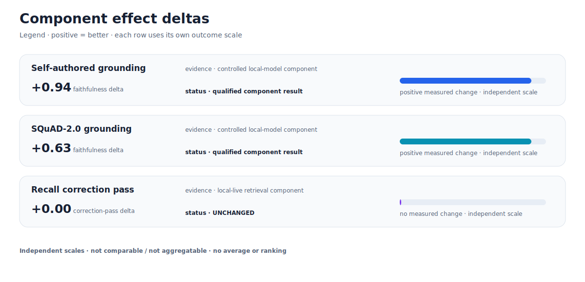
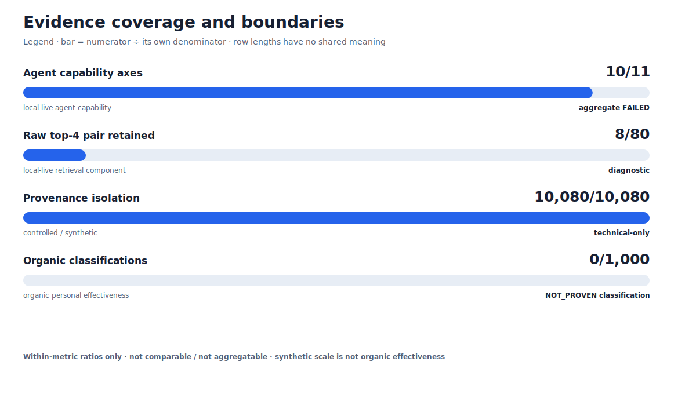
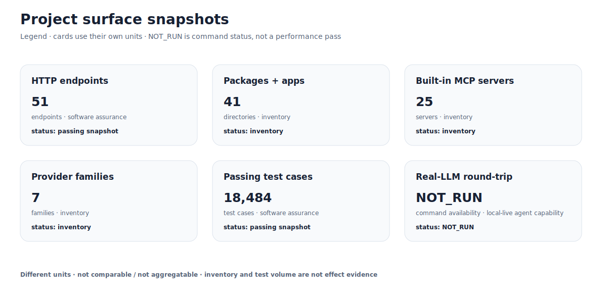
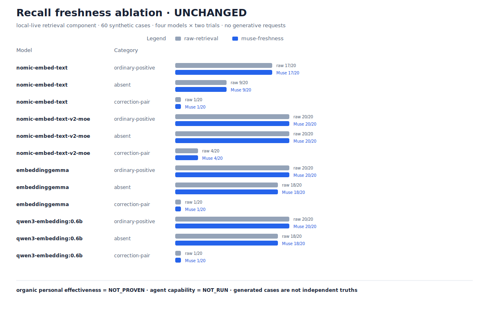
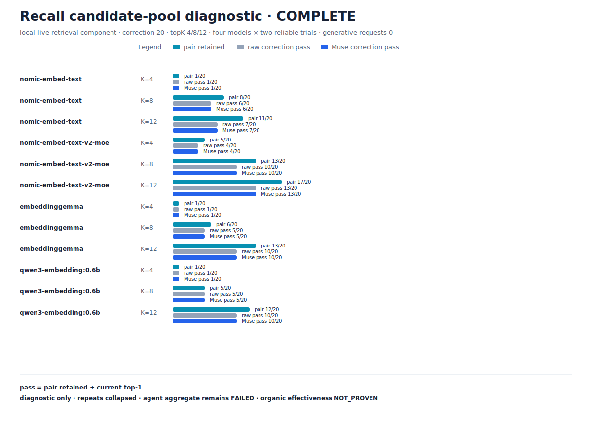
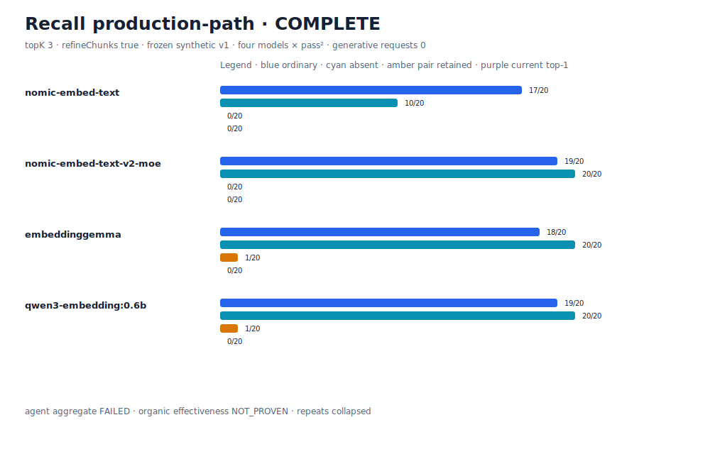

<p align="center">
  
</p>

<p align="center"><i>Meet Muse — a personal AI project built to understand the life you are already living.</i></p>

<h1 align="center">Muse</h1>

<p align="center">
  <b>Building a personal AI that learns how you live and work—and gets better at knowing when and how to help.</b><br/>
  <i>Local-first, provider-neutral, and honest about what is not built yet.</i>
</p>

<p align="center">
  <a href="LICENSE"></a>
  <a href="package.json"></a>
  <a href="https://www.typescriptlang.org/"></a>
  <a href="#what-muse-will-not-do-boundaries"></a>
  <a href="https://ollama.com"></a>
  &nbsp;·&nbsp; <a href="README.ko.md">한국어</a>
</p>

Muse is meant to be a continuing personal agent for one person's life and work—not only a
work assistant. It should remember context, coordinate personal tools, stay quiet when that
is better, and learn whether its last suggestion actually helped. We call this
**Attunement**: learning how to live and work well with you, not only storing facts about you.

The first proof point is **Personal Continuity**: helping you pick up an unfinished thread
without reconstructing it from scratch. That thread might be a project, a trip, a health
appointment, someone you meant to contact, or an article you were reading. In the first
version, you choose the thread and its related Muse items; automatic detection comes later.
The first local CLI slice now works with explicit local tasks and notes: create a thread,
link exact sources, run `muse continue`, then record whether it helped. Automatic detection,
timing, and observation remain later work. **Work Resumption** is one specialized use of it,
not Muse's whole identity.

> **What works today:** personal memory, grounded recall, local personal stores, opt-in
> ambient snapshots, pattern and interruption controls, guarded browser actions, traces,
> checkpoints, and the first local Personal Continuity path. **What comes next:** more source
> adapters, opt-in observation, and better timing. See the
> [product contract](docs/strategy/attunement.md) and [implementation plan](docs/goals/attunement-implementation-plan.md).

<p align="center"></p>

---

## 📊 Muse in numbers

Every number is reproducible from this repo — its source and command sit directly below each chart. Test counts and synthetic scale are **not agent-effect proof**; evidence classes are deliberately kept separate. Organic personal effectiveness is **NOT_PROVEN**.



Source: [canonical evidence dashboard](docs/benchmarks/evidence-dashboard.json) · reproduce with `pnpm evidence:dashboard:render` · validate with `pnpm evidence:dashboard:validate`.



Source: [evidence index](docs/benchmarks/EVIDENCE.md) · reproduce with `pnpm evidence:dashboard:render`.



Source: [canonical evidence dashboard](docs/benchmarks/evidence-dashboard.json) · reproduce with `pnpm evidence:dashboard:render`. Different units are not compared or aggregated.



Source: [qualified recall freshness result](docs/benchmarks/recall-freshness-ablation.md) · reproduce with `pnpm eval:recall-freshness-ablation`.



Source: [candidate-pool diagnostic](docs/benchmarks/recall-candidate-pool.md) · reproduce with `pnpm eval:recall-candidate-pool` · validate with `pnpm eval:recall-candidate-pool:validate`.



Source: [production-path result](docs/benchmarks/recall-production-path.md) · [canonical JSON](docs/benchmarks/recall-production-path.json) · reproduce with `pnpm eval:recall-production-path` · validate with `pnpm eval:recall-production-path:validate`. Frozen synthetic v1 is not held-out or organic evidence; the agent aggregate remains **FAILED** and organic effectiveness remains **NOT_PROVEN**.

---

## ✨ Why Muse — five principles

Read these five and you know exactly what kind of agent this is.

1. **Learns how to fit into your life.**
   Facts and preferences matter, but the goal is broader: learn when to stay quiet, what
   kind of help fits, and whether it worked. The technical name for this is Attunement.
   Today Muse ships foundations for it; the complete learning loop is still a roadmap.

2. **Yours — _your personal layer can stay on your machine._**
   Muse can use a local or cloud model. With no cloud credential it falls back to the local
   Ollama model; an available cloud key may select that provider. Set `MUSE_LOCAL_ONLY=true`
   when you need a strict on-device model boundary: cloud providers are then refused in
   code. Personal file-backed stores remain local by default.

3. **Shows the evidence where it uses your data.**
   Grounded recall and other supported personal-data paths attach real sources, lower weak
   matches, and reject invalid citations. This protection is not universal yet: a fast,
   uncited chat sentence can still slip past the citation checker. That gap is documented
   instead of hidden behind a “zero hallucinations” promise.

4. **Correctable — _your correction changes the next collaboration._**
   Muse can reinforce strategies that work, retire inferred strategies that conflict with
   your correction, and remember vetoes. Attunement extends this discipline from answer
   content to intervention timing and form—without changing model weights or silently
   overriding explicit user rules. (`muse memory`, `muse doctor --weaknesses`)

5. **Yours to act through — _draft-first, never autonomous._**
   Acts through your real tools (calendar, notes, tasks, reminders, the web) — but any
   send or action toward another person is **draft-first and needs your explicit
   confirmation**. Banking and money movement are permanently out of scope.

> Attunement is the product promise. Local-first ownership, grounding, correction, and
> draft-first action are the trust floor that makes it safe to pursue.

A native **macOS desktop companion** is the newest surface — a floating, voice-capable
pixel bluebird (on-device speech via WhisperKit + Qwen3-TTS) wrapping the same
provider-neutral, grounded runtime and console:

<p align="center"></p>

---

## ⚡ See it

```bash
# Requirements: Git + Node.js >= 22.12 (24 LTS recommended) + pnpm 10
git clone https://github.com/wlsdks/muse-agent.git
cd muse-agent
corepack enable
pnpm install:muse
muse onboard

# 30-second JARVIS demo (runs on your local default model, gemma4:12b via Ollama):
pnpm demo
```

The supported source install stays on a clean `main` checkout. It performs a
frozen dependency install, builds the workspace, globally links the `muse` CLI,
and verifies the built CLI. Update with `muse update`; remove the global link
with `pnpm --global remove @muse/cli`. Preview without changing anything using
`pnpm install:muse -- --dry-run`.

The demo exercises chat with cross-turn memory, a credential-free proactive notice, the
setup diagnostic, and the Codex / Claude Desktop MCP bridge in one narrated run. Then
`muse onboard` walks you — one command at a time — from a fresh install to your first
private, cited answer.

`muse ask` is the trust floor in one screenshot — the answer cites its source, and the
receipt below it is openable (screenshots captured 2026-07-17 on a clean demo home,
local gemma4:12b, no cloud key):

<p align="center"></p>

`muse status` and `muse today` render entirely from your local stores — **no API key
required**:

| `muse today` | `muse status` |
| --- | --- |
|  |  |

The same runtime drives the web console (and the native macOS app, which bundles it) —
chat with tool receipts, the model chip showing what's answering right now, and a home
view for what Muse has learned:

<p align="center"></p>

### Daily-driver flows

```bash
# Personal Continuity — you choose the life/work thread and its exact local sources:
muse thread start "Plan a birthday" --kind life
muse thread link <thread-id> note birthday.md --role context
muse thread link <thread-id> task <task-id> --role next-step
muse continue <thread-id>
muse thread outcome <delivery-id> used

# JARVIS REPL — continuous conversation, token streaming, persona-aware (type /help):
muse chat --local --user me

# Ad-hoc summarisation over stdin:
cat note.md | muse chat --local --no-tools "한 단락으로 요약"   # gemma4:12b by default

# Real-time proactive daemon — notices address you by name, in your language:
muse proactive watch --user me --interval 60

# At-a-glance dashboard — model, persona, imminent tasks, last notice:
muse status --user me
```

### What "JARVIS" means in Muse

Muse keeps a persistent personal model at `~/.muse/user-memory.json` keyed by `--user <id>`.
Every REPL turn the model sees your **facts** (`name`, `city`, `role`…), **preferences**
(`language`, `reply_style`…), **vetoes** (things it must never suggest), **goals**, and the
current local **date / time**. Facts are auto-extracted from chat, taught with `/remember`,
or set directly with `muse memory set` (no-LLM path).

The same persona ships into `muse proactive watch`, so *"Send Q3 memo due in 5 min"* gets
translated through your prefs and lands as **"Q3 예산 메모를 금융팀에 보내야 합니다. 지금
작성 시작할까요?"** — same daemon, same model, no extra work. Muse doesn't just wrap a model
for a single call; it remembers you and shapes every future turn *and* every proactive notice.

---

## 🔧 Under the hood

- **Model-neutral core.** OpenAI, Anthropic, Google Gemini, OpenRouter, Ollama, LM Studio,
  and any OpenAI-compatible endpoint live behind a single `ModelProvider` adapter. The
  runtime calls the abstraction, never a vendor SDK directly. CLI-local turns, API/web chat,
  inbound messaging, scheduled agent jobs, and delegated workers all enter through the same
  `createMuseRuntimeAssembly` → `AgentRuntime` composition root. Delegated workers carry only
  Muse model IDs; the runtime's shared provider registry resolves them.
- **Tool & MCP first.** Tools are first-class — read, write, or execute — with explicit risk
  levels, approval gates, and deterministic loop limits. 25 in-process `muse.*` servers ship
  built-in (eight pure-utility: `time` / `text` / `math` / `json` / `url` / `crypto` / `diff` /
  `regex`, plus the personal-domain set); external servers connect over stdio / SSE /
  streamable-HTTP. `muse mcp serve` runs the reverse direction — Muse itself AS a local,
  read-only MCP server (`muse_recall` cited grounded Q&A, `knowledge_search` ranked search,
  `user_model_read` your facts/preferences with confidence) another agent can connect to;
  see [MCP server mode](#mcp-server-mode-muse-mcp-serve) below.
- **Personal-domain primitives.** Markdown notes, a todo list, reminders, contacts, and calendar
  events across 5 providers (Local file, Local-ICS, Google Calendar, CalDAV, macOS Calendar.app) —
  plus macOS Reminders / Notes mirrors — all stored locally by default, queryable by the agent,
  editable from CLI / Web UI.
- **Multi-agent orchestration.** Sequential or parallel worker fan-out, an in-memory
  cross-agent message bus, per-run history with full conversation snapshots, per-worker model
  routing, and a bounded fast→heavy cascade — exposed over HTTP and SSE without a second agent
  runtime.
- **Messaging channels.** Inbound/outbound adapters for **Telegram, Discord, Slack, and LINE**
  (plus local macOS desktop notifications), all routed through the same fail-closed
  channel-approval gate — a reply toward a person is draft-first, never autonomous.
- **Deterministic safety.** Guards are fail-close, hooks are fail-open, security lives in code
  (never in prompt instructions). Tool output is untrusted until sanitised. Risky local
  command execution is outside standard personal runtimes; use a dedicated coding tool
  outside Muse Work when that capability is needed.

<details>
<summary><b>Repository layout</b></summary>

```
apps/
  api/        Fastify API server (chat, agent specs, multi-agent, MCP, scheduler, calendar, tasks)
  cli/        terminal agent (commander + Ink TUI + setup wizards)
  web/        React console — chat-first shell (Home, Chat, Integrations, Notes, Memory,
              Continuity, Settings; engine-room panels behind a developer toggle)
  desktop/    native macOS floating companion (SwiftPM)

packages/
  agent-core/    ReAct + Plan-Execute loops, guard pipeline, hook registry, model loop
  model/         ModelProvider interface + provider wire-format adapters
  tools/         tool registry, executor, sanitiser, approval path
  multi-agent/   SupervisorAgent, MultiAgentOrchestrator, message bus, history
  mcp/           MCP transports + loopback servers (notes / tasks / calendar) + NotesProvider
  calendar/      CalendarProvider abstraction + Local / ICS / Google / CalDAV / macOS adapters
  policy/        input / output guards, approval policies, adversarial red-team harness
  memory/        context trimming, summaries, user-memory store + auto-extraction hook
  observability/ tracing, latency / token-cost queries, JARVIS snapshot
  recall/        grounded-recall presentation / orchestration
  skills/        self-authored skills (author / curate / merge)
  a2a/           Muse-to-Muse swarm + council federation
  messaging/     Telegram / Discord / Slack / LINE adapters
  voice/         STT / TTS registry (local + cloud)
  browser/       real-Chrome control (opt-in, gated)
  autoconfigure/ zero-config provider / model / index resolution
  db/ scheduler/ auth/ cache/ resilience/ runtime-state/ runtime-settings/ macos/ prompts/ shared/

crates/
  runner/        Direct/test-only Rust runner artifact; never registered by standard model runtimes
```
</details>

---

## What Muse will not do (boundaries)

Deliberate product boundaries, enforced in code — not TODOs:

- **No money movement.** Muse never connects to bank / brokerage accounts, initiates payments,
  or moves money. The blast radius is irreversible for a single-user assistant; a permanent
  boundary, not a deferral ([`outbound-safety.md`](.claude/rules/outbound-safety.md)).
- **No autonomous third-party sends.** Anything that transmits to another person (email, chat,
  message, web form / booking) is **draft-first and you confirm the exact content** before it
  leaves. The approval gate is fail-closed: deny / timeout / ambiguous recipient ⇒ nothing is sent.
- **Single user, single environment.** No multi-tenant accounts, no shared workspace, no RBAC.
  Identity is your local `$USER`.
- **Vision input — one path excepted.** Image attachments are serialized on local **Ollama**
  (`muse ask --image`), **Anthropic**, OpenAI **Chat-Completions**, OpenAI-compatible /
  OpenRouter, and **Gemini**. The only exception is the OpenAI **Responses** API path (text-only).
  Under explicit local-only mode, image bytes never leave the machine regardless.

---

## 🪟 Windows

Muse core runs on Windows: the CLI, the API server, grounded recall, and the
local Ollama model ([Ollama for Windows](https://ollama.com/download/windows)).
Platform behavior is gated in CI on `windows-latest`; macOS-only integrations
(Apple Notes/Reminders mirrors, Contacts import, the desktop companion) are
disabled automatically — `muse doctor` shows the exact posture for your OS.

- Native actuators: set `MUSE_WINDOWS_ACTUATORS=true` to arm the PowerShell
  tool set — open apps/URLs, read battery/wifi/storage/frontmost window, set
  the clipboard, speak text, take screenshots, control media, and change
  volume / display sleep. Dark by default, like the macOS actuators.
- Ambient awareness: `MUSE_AMBIENT_SOURCE=windows` feeds the proactive daemon
  the frontmost window (clipboard strictly opt-in).
- Autostart: `muse daemon --install` registers a `schtasks` logon task
  (LaunchAgent on macOS).
- Media/volume key events are CI-verified only (no observable state on a
  runner) — report anything odd via issues.
- Voice output uses PowerShell's wav player; recording needs
  [sox for Windows](https://sourceforge.net/projects/sox/) on PATH.
- Windows paths are CI-verified; report anything odd via issues.

## 🧩 Providers & configuration

Pick a model at runtime via env:

| Env | Example | Notes |
| --- | --- | --- |
| `MUSE_MODEL` | `gemini/gemini-2.0-flash` | `<providerId>/<modelId>` form |
| `MUSE_MODEL_PROVIDER_ID` | `gemini` | optional override; inferred from prefix |
| `MUSE_MODEL_API_KEY` | `…` | per-provider env vars (`OPENAI_API_KEY`, `ANTHROPIC_API_KEY`, `GEMINI_API_KEY`, `OPENROUTER_API_KEY`) also work |
| `MUSE_MODEL_BASE_URL` | `http://localhost:11434/v1` | overrides for OpenAI-compatible endpoints (Ollama, LM Studio, custom) |

**Free / offline path** — Ollama with an open-source model:

```bash
brew install ollama && ollama serve &
ollama pull gemma4:12b                 # the shipped default — multimodal + grounding-strong
muse setup local                       # wires defaultModel into ~/.config/muse/config.json
```

See [`docs/setup-local-llm.md`](docs/setup-local-llm.md) for the four tiers
(0.8B / 2B / 9B / 27B), license notes, and a latency-measuring dogfood script.

<details>
<summary><b>First-run troubleshooting</b></summary>

| Symptom | Fix |
| --- | --- |
| Local model calls fail / time out | Start Ollama: `ollama serve` (probes `${OLLAMA_BASE_URL:-http://localhost:11434}`) |
| `model not found` | Pull the shipped default: `ollama pull gemma4:12b` |
| Not sure what's wired (model, posture, providers) | `muse doctor` reports the local-only posture and resolved configuration |

`smoke:live` auto-skips when Ollama is unreachable — a skip means the local runtime
isn't up, not that anything is broken.
</details>

### MCP server mode (`muse mcp serve`)

Expose Muse itself as a local MCP server so another agent (Claude Code, Cursor, Codex, …)
can call it: your grounded, cited notes recall and the facts/preferences Muse has learned
about you, available as local tools to every agent you use — nothing leaves your machine.

```bash
claude mcp add muse -- muse mcp serve
```

Three read-only tools, no write/outbound access, no network listener (stdio only):

| Tool | What it does |
| --- | --- |
| `muse_recall` | Cited, gated Q&A over your notes — a weak match answers "I'm not sure", never a guess (requires Ollama) |
| `knowledge_search` | Deterministic ranked search over your notes + remembered facts/preferences (works even with no model running) |
| `user_model_read` | Your facts/preferences with a confidence score; never returns anything vetoed or forgotten |

Running `muse mcp serve` is your explicit consent to expose these read tools to the
connecting client. See `.claude/rules/outbound-safety.md` for why write/outbound tools
aren't in scope here.

**Cloud + API server (BYOK)** — select a cloud provider (incompatible with `MUSE_LOCAL_ONLY=true`):

```bash
GEMINI_API_KEY=… MUSE_MODEL=gemini/gemini-2.0-flash MUSE_MODEL_PROVIDER_ID=gemini \
  pnpm --filter @muse/api dev
curl -X POST http://127.0.0.1:3030/api/chat -H 'content-type: application/json' \
  -d '{"message":"What time is it? Use a tool."}'
pnpm --filter @muse/web dev            # or the Web UI → http://localhost:5173
```

<details>
<summary><b>Personal-domain toggles</b></summary>

| Env | Default | Effect |
| --- | --- | --- |
| `MUSE_NOTES_DIR` | `~/.muse/notes` | Markdown notes directory (point at an Obsidian vault to query it) |
| `MUSE_NOTES_ENABLED` | `true` | Disable `muse.notes.*` tools |
| `MUSE_TASKS_FILE` | `~/.muse/tasks.json` | Todo list file |
| `MUSE_CALENDAR_FILE` | `~/.muse/calendar.json` | Local calendar provider file |
| `MUSE_CALENDAR_PROVIDERS` | `local` | Comma list: `local,ics,gcal,caldav,macos` |
| `MUSE_CREDENTIALS_FILE` | `~/.muse/credentials.json` | chmod-600 OAuth / app-password store |
| `MUSE_USER_MEMORY_AUTO_EXTRACT` | `true` | LLM auto-extracts facts/preferences after each turn |

Set up calendar providers interactively with `muse setup calendar` (multi-select
Local / Local-ICS / Google / CalDAV / macOS; OAuth + app-password flows; chmod-600 credentials).
</details>

---

## ✅ Verification

Tests are the only form of verification. The repo ships these gates:

```bash
pnpm check        # build + test for every workspace (18,484 cases across 37 packages + 4 apps)
pnpm smoke:broad  # 51 HTTP endpoints, diagnostic provider (no key)
pnpm smoke:live   # real LLM round-trip — LOCAL OLLAMA ONLY, gemma4:12b (auto-skips if unreachable)
pnpm eval:agent   # long 11-axis live capability aggregate; nightly/manual, not pre-push
```

The latest qualified live result is **10/11 axes passed with 0 unverified**;
the executed recall axis failed, so this is not an all-green claim. See the
[agent capability baseline](docs/development/agent-capability-baseline.md) for
per-axis `pass^k`, durations, the recall gap, and non-additive regression
evidence. `eval:agent` is a long local-model/Chrome suite for nightly or manual
verification, not a pre-push requirement.

`smoke:live` is **local Ollama only by deliberate policy** — it probes
`${OLLAMA_BASE_URL:-http://localhost:11434}` and asserts the model→tool→model loop
end-to-end across direct chat, streaming SSE, plan-execute, input guards, multi-agent
orchestration, `muse.notes.search`, `muse.tasks.add`, and `muse.calendar.add`. Cloud
provider keys are intentionally never consulted.

---

## 📚 Research & attributions

Muse is an independent MIT project. The designs below were **studied and reimplemented from
scratch** (no third-party source copied) — we record where the ideas came from, per feature.
Full notices: [`THIRD_PARTY_NOTICES.md`](THIRD_PARTY_NOTICES.md).

| Feature | Borrowed idea | Source |
| --- | --- | --- |
| **Held-out validation gate** over self-edits — a merged skill, playbook strategy, or inferred preference commits only if semantically supported by its evidence, else dropped (script-aware, so bilingual KO/EN learning isn't false-rejected) | propose-and-test self-improvement | **SkillOpt**, Microsoft (MIT) — [arXiv 2605.23904](https://arxiv.org/abs/2605.23904) |
| Session-end skill authoring, curator consolidation, behavior-inferred user model, background-review engine | fork-and-review self-improvement | **Hermes Agent**, Nous Research (MIT) |
| Recurring-theme surfacing, episode consolidation, skill-body risk scan, commitment extraction | sleep/"dreaming" memory consolidation | **OpenClaw** (MIT) |
| Grounded reflection synthesis (insights cite their source episodes) | offline reflection over observations | Generative Agents — [arXiv 2304.03442](https://arxiv.org/abs/2304.03442) |
| Confidence-gated cited recall ("I'm not sure" floor) | lightweight retrieval evaluator | CRAG — [arXiv 2401.15884](https://arxiv.org/abs/2401.15884) |
| Long-context passage reordering (strong sources at head/tail) | "Lost in the Middle" | [arXiv 2307.03172](https://arxiv.org/abs/2307.03172) |
| Preference inference from real corrections (not self-judgement) | distil from outcome signals | ReasoningBank — [arXiv 2509.25140](https://arxiv.org/abs/2509.25140) |

### Cross-field mechanism distillation (research discipline)

Beyond the AI-agent literature, Muse continuously mines OPEN papers from **many fields** —
biology, ecology, neuroscience, network science, control theory, decision & information
theory, linguistics, psychology, forensic & environmental statistics — distilling a real
mechanism into a deterministic, live-verified capability.

<details>
<summary><b>The full mechanism catalog</b></summary>

| Field | Mechanism (paper) | Muse capability |
| --- | --- | --- |
| Ecology | Optimal foraging / Marginal Value Theorem (Charnov 1976) | `muse recall --adaptive` — the evidence picks how many sources to return |
| Collective behaviour / biology | Stigmergy, ant pheromone trails (Grassé 1959; Vittori 2006) | `muse notes trails` / `hubs` — an evaporating co-recall relatedness graph |
| Physiology / neuroscience | Allostasis — predictive regulation (Sterling 2012) | `muse pattern upcoming` — anticipate a recurring need before its slot |
| Network science | k-shell decomposition / influential spreaders (Kitsak et al. 2010) | `muse notes hubs` — the load-bearing core of your notes (depth, not degree) |
| Network science / ecology | Betweenness / brokerage (Freeman 1977; Burt 1992) + keystone species (Paine 1966) | `muse notes bridges` — the notes connecting your separate topic clusters |
| Control theory / SPC | CUSUM change-point (Page 1954) | `muse pattern lapsed` — a recurring habit that has STOPPED |
| Decision / information theory | Expected information gain / EVPI (Lindley 1956; Howard 1966) | `muse ask` clarify arm — ask when divergent sources tie, vs guess or abstain |
| Computer science (web-scale) | Broder resemblance / shingling (Broder 1997) | `muse feeds` near-duplicate collapse (same story across outlets) |
| Information science | Luhn extractive summarization (Luhn 1958) | `muse summarize` — a document's own key sentences (cannot fabricate) |
| Computational linguistics | Pointwise mutual information (Church & Hanks 1990) | `muse contacts related` — inferred relationship edges from co-mention |
| Queueing / operations research | Little's Law L=λW (Little 1961) | `muse tasks flow` — are you finishing tasks as fast as you add them? |
| Real-time systems / scheduling | Earliest Deadline First (Liu & Layland 1973) + aging | `muse tasks next` — what to do NOW, with a why-now; old tasks aged up |
| Cognitive psychology | Autobiographical / date-cued recall (Rubin et al. 1986) | `muse on-this-day` — notes from today's date in earlier years |
| Organizational psychology | Attention residue / deep work (Leroy 2009) | `muse calendar focus` — your longest uninterrupted block |
| Psychology | Implementation intentions / time-blocking (Gollwitzer 1999) | `muse calendar block` — book the next free slot to protect focus |
| Cognition / strategy | First-principles (Musk) + contrarian question (Thiel) | reasoning principles in `muse ask` — the engine; the grounding floor is the brake |

Each mechanism cites its paper in the module header; the verified feature inventory lives in
[`docs/feature-catalog/INDEX.md`](docs/feature-catalog/INDEX.md).
</details>

Deep dives: [differentiation](docs/strategy/differentiation.md) ·
[verified feature catalog](docs/feature-catalog/INDEX.md).

---

## 📖 Documentation

| Goal | Read |
| --- | --- |
| Understand the Attunement product contract | [`docs/strategy/attunement.md`](docs/strategy/attunement.md) |
| Inspect the architecture, privacy boundary, and current gaps | [`docs/design/attunement.md`](docs/design/attunement.md) |
| Build and falsify the first closed loop | [`docs/goals/attunement-implementation-plan.md`](docs/goals/attunement-implementation-plan.md) |
| Run on a local open-source model (tiers, licenses, latency) | [`docs/setup-local-llm.md`](docs/setup-local-llm.md) |
| The verified, proof-cited feature inventory | [`docs/feature-catalog/INDEX.md`](docs/feature-catalog/INDEX.md) |
| Inspect trust foundations and the historical competitor ledger | [`docs/strategy/differentiation.md`](docs/strategy/differentiation.md) |
| Security posture & reporting | [`SECURITY.md`](SECURITY.md) |
| The bluebird mascot — concept, states, palette, single-source pixels | [`docs/design/mascot.md`](docs/design/mascot.md) · [showroom](docs/design/mascot-showroom.html) |
| Korean overview | [`README.ko.md`](README.ko.md) |

---

## 💬 Community & support

Questions, bugs, and feature ideas go through GitHub:

- **Issues** — [github.com/wlsdks/Muse/issues](https://github.com/wlsdks/Muse/issues)
- **Security reports** — see [`SECURITY.md`](SECURITY.md) (do not open a public issue for vulnerabilities)

---

## Contributing

This repo follows a lean-contract style for Claude Code collaboration:

- [`CONTRIBUTING.md`](CONTRIBUTING.md) — local setup, verification gates, commit / lint / test discipline
- [`CLAUDE.md`](CLAUDE.md) — the contract every Claude Code agent reads first
- [`.claude/rules/`](.claude/rules/) — domain rules (architecture, testing, commits, code style, …)
- [`CHANGELOG.md`](CHANGELOG.md) · [`SECURITY.md`](SECURITY.md) · [`CODE_OF_CONDUCT.md`](CODE_OF_CONDUCT.md)

Use Conventional Commits (`feat:`, `fix:`, `refactor:`, `test:`, `docs:`, `chore:`). Commits
and PR descriptions are written in English.

## License

[MIT](LICENSE). The runtime, adapters, and tooling are open source. Contributions are accepted
under the same terms — see [`CONTRIBUTING.md`](CONTRIBUTING.md).
