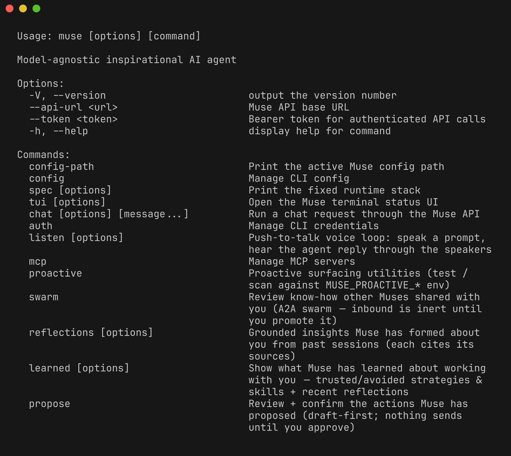
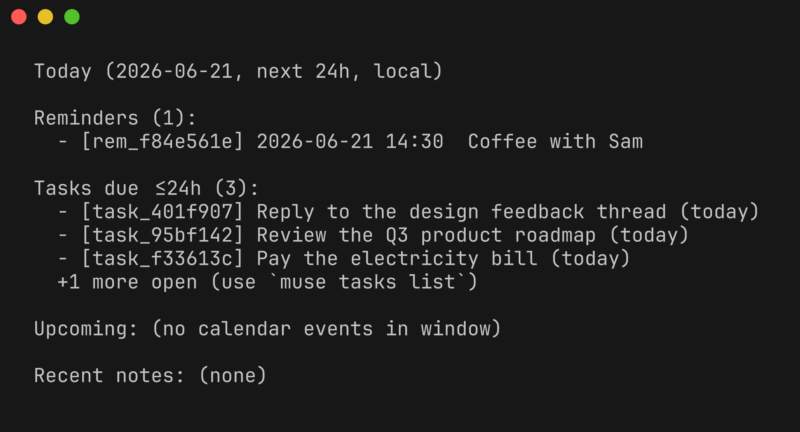
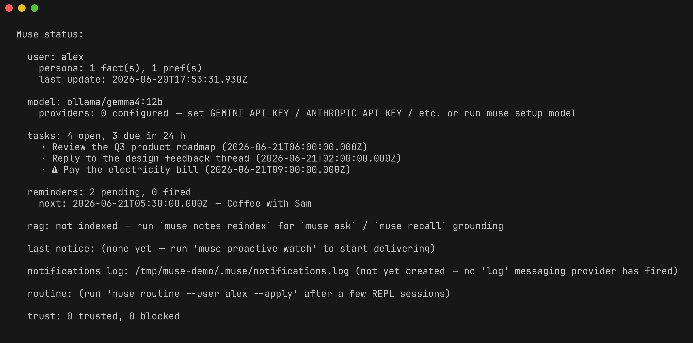

# Muse

> **Tell it everything. It can't tell anyone.**

Your AI assistant that answers from your own notes and files — quotes the
exact source, says "I'm not sure" instead of making things up, and runs
entirely on your machine. Nothing ever leaves it. That's not a setting;
it's enforced in the code.

**Quickstart:** `muse onboard` walks you — one command at a time — from a
fresh install to your first private, cited answer (point it at a notes
folder, or `muse ingest` a ChatGPT/Claude export or an `.mbox`, then
`muse ask --notes-only "…"`).

[한국어 README →](README.ko.md)

<!--LIVE_URL-->📊 **Live progress:** _not exposed yet — start it with `pnpm dashboard:tunnel` (needs the `cloudflared` binary; no account). The loop writes the current public URL on this line and refreshes it when it rotates. Locally any time: `node scripts/dashboard-server.mjs` → <http://127.0.0.1:8787> (read-only, 127.0.0.1-only)._<!--/LIVE_URL-->

## What Muse is

Muse is the AI assistant that's **actually yours**. Point it at the
notes, files, and mail you'd never paste into ChatGPT — it answers from
**your own** corpus with the exact passage quoted, and the part that earns
your trust is what it does when it *isn't* sure: a deterministic confidence
gate (not the model's guess) flags weak matches as "verify before relying"
and says "no matching passages" rather than confabulate. It learns only you,
grows more *you* over time, and acts through your real tools — calendar,
notes, tasks, messaging, the web — always draft-first, never an autonomous
send.

And it runs **entirely on your own machine**. By default Muse uses a local
open-source model (qwen3:8b via Ollama, or any HuggingFace weights you run
locally) and **refuses cloud egress in code** — `MUSE_LOCAL_ONLY` is on by
default, so the runtime won't even start against a cloud provider unless you
explicitly opt out (and forfeit the guarantee). Not your agent on someone
else's cloud. Actually yours. The same runtime drives the CLI, the API, and
the web UI — the model-neutral core can still reach any provider when you
opt out, but local is the default it ships and defends. Under the hood:

- **Model-neutral core.** OpenAI, Anthropic, Google Gemini, OpenRouter,
  Ollama, LM Studio, and any OpenAI-compatible endpoint live behind a
  single `ModelProvider` adapter. The runtime calls the abstraction,
  never a vendor SDK directly.
- **Tool & MCP first.** Tools are first-class — read, write, or
  execute — with explicit risk levels, approval gates, and
  deterministic loop limits. ~23 in-process `muse.*` servers ship
  built-in: eight pure-utility ones (`muse.time`, `muse.text`,
  `muse.math`, `muse.json`, `muse.url`, `muse.crypto`, `muse.diff`,
  `muse.regex`) plus the personal-domain set (`muse.notes`,
  `muse.tasks`, `muse.calendar`, `muse.reminders`, `muse.episode`,
  `muse.history`, `muse.status`, `muse.search`, `muse.fetch`,
  `muse.fs`, `muse.pattern`, `muse.proactive`, `muse.followup`,
  `muse.messaging`, `muse.context`); external servers connect over
  stdio / SSE / streamable-HTTP.
- **Personal-domain primitives.** Markdown notes, calendar events
  across 4 providers (Local file, Google Calendar, CalDAV, macOS
  Calendar.app), and a todo list — all stored locally by default,
  queryable by the agent, and editable from CLI / Web UI.
- **Multi-agent orchestration.** Sequential or parallel worker
  fan-out, an in-memory cross-agent message bus, per-run history
  with full conversation snapshots, and aggregate stats — all
  exposed over HTTP and SSE.
- **Deterministic safety.** Guards are fail-close, hooks are
  fail-open, and security lives in code (not in prompt instructions).
  Tool output is untrusted until sanitised. Risky local execution
  flows through a separate Rust runner (`crates/runner`).

## What Muse will not do (boundaries)

These are deliberate product boundaries, enforced in code — not TODOs:

- **No money movement.** Muse never connects to bank / brokerage
  accounts, initiates payments, or moves money. The blast radius is
  irreversible for a single-user assistant; this is a permanent
  boundary, not a deferral (see
  [`outbound-safety.md`](.claude/rules/outbound-safety.md)).
- **No autonomous third-party sends.** Anything that transmits to
  another person (email, chat, message, web form / booking) is
  **draft-first and you confirm the exact content** before it leaves.
  The approval gate is fail-closed: deny / timeout / ambiguous
  recipient ⇒ nothing is sent. Messaging sends (`muse.messaging.send`)
  are gated by the runtime approval gate in the shipping CLI / API
  paths and now also self-record every send to the action log (see
  [`docs/audit/2026-05-25-feature-usecase-audit.md`](docs/audit/2026-05-25-feature-usecase-audit.md)
  F-1).
- **Single user, single environment.** No multi-tenant accounts, no
  shared workspace, no RBAC. Identity is your local `$USER`.
- **Vision input is provider-limited.** Image attachments are
  serialized only on the OpenAI Chat-Completions path,
  OpenAI-compatible / OpenRouter, and Gemini. They are **not** sent on
  Anthropic (capability declared but unwired) or local Ollama, and not
  on the OpenAI Responses path. See the vision matrix in the audit doc.

## Architecture at a glance

```
apps/
  api/        Fastify API server (chat, agent specs, multi-agent, MCP,
              scheduler, calendar, tasks)
  cli/        terminal agent (commander + Ink TUI + setup wizards)
  web/        React UI (chat + tasks + calendar + settings)

packages/
  agent-core/         ReAct + Plan-Execute loops, guard pipeline,
                      hook registry, context transforms, model loop
  model/              ModelProvider interface + provider wire-format
                      adapters (OpenAI / Anthropic / Gemini / OpenRouter /
                      Ollama + OpenAI-compat presets for Groq / DeepSeek /
                      Together / Mistral / Moonshot / Cerebras)
  tools/              tool registry, executor, sanitiser, approval path
  multi-agent/        SupervisorAgent, MultiAgentOrchestrator,
                      message bus, history
  mcp/                MCP transports + loopback servers (incl.
                      notes / tasks / calendar) + NotesProvider abstraction
  calendar/           CalendarProvider abstraction +
                      Local / Google / CalDAV / macOS adapters +
                      chmod-600 credential store
  policy/             input / output guards, approval policies,
                      adversarial red-team harness
  memory/             context trimming, conversation summaries,
                      user-memory store + auto-extraction hook
  observability/      tracing, latency / token-cost queries,
                      JARVIS snapshot
  runtime-state/      run history, hook traces, approval store
  db/                 Kysely schema + SQL migrations
  scheduler/          cron jobs + distributed locks
  ...

crates/
  runner/             Rust sandbox: shell / process / file execution
```

## Quick start

```bash
# Requirements: Node.js 24 LTS + pnpm 10
pnpm install
pnpm build
pnpm test

# 30-second JARVIS demo (auto-picks any local Ollama Qwen 2.5 you have):
pnpm demo
```

The demo exercises chat with cross-turn memory, a credential-free
proactive notice, the setup diagnostic, and the Codex / Claude
Desktop MCP bridge in one narrated run.

The full command surface (`muse --help`):



### Daily-driver flows

```bash
# JARVIS REPL — continuous conversation, token streaming, persona-aware.
# The interactive REPL is `chat --local`; type /help to list slash commands:
muse chat --local --user me

# Stdin piping for ad-hoc summarisation:
cat note.md | muse chat --local --no-tools --model ollama/qwen2.5:7b-instruct "한 단락으로 요약"

# Real-time proactive daemon (Ctrl-C to stop). Notices are
# personalised — they address you by name in your preferred language:
muse proactive watch --user me --interval 60

# At-a-glance dashboard — model, persona, imminent tasks, last notice:
muse status --user me
```

`muse status` and `muse today` render entirely from your local stores —
no API key required (they fall back to a local briefing when the API
server isn't running):

| `muse today` | `muse status` |
| --- | --- |
|  |  |

### What "JARVIS" means in Muse

Muse keeps a persistent personal model at `~/.muse/user-memory.json`
keyed by `--user <id>`. Every REPL turn the model sees:

- Your **facts** (`name`, `city`, `role`, …) — auto-extracted from
  chat, taught in the REPL with `/remember …`, or set directly with
  `muse memory set fact <key> <value>` (no-LLM path)
- Your **preferences** (`language`, `reply_style`, …) — same auto-
  extract path, REPL slash command `/pref key=value`
- Your **vetoes** (`no_coffee`, `no_email_after_9pm`, …) — things
  Muse must never suggest. Recognised when you state a hard rule.
- Your **goals** — active objectives Muse can steer toward
- The current local **date / time / day-of-week**

The same persona ships into `muse proactive watch`, so the
notification "Send Q3 memo due in 5 min" gets translated through
your prefs and lands as **"Q3 예산 메모를 금융팀에 보내야 합니다. 지금
작성 시작할까요?"** — same daemon, same model, no extra work.

That is the differentiator: Muse doesn't just wrap a model for a
single call — it remembers you, learns from natural conversation,
and uses what it learns to shape every future turn AND every
proactive notice.

### Cloud + API server (BYOK)

```bash
GEMINI_API_KEY=… MUSE_MODEL=gemini/gemini-2.0-flash MUSE_MODEL_PROVIDER_ID=gemini \
  pnpm --filter @muse/api dev

curl -X POST http://127.0.0.1:3030/api/chat \
  -H 'content-type: application/json' \
  -d '{"message":"What time is it? Use a tool."}'

# Or open the Web UI:
pnpm --filter @muse/web dev   # http://localhost:5173
```

Native web search is enabled by default for OpenAI / Anthropic / Gemini.
Responses include `citations[]`; disable with `MUSE_WEB_SEARCH=off`.

## Personal-domain tools

The agent ships three personal-pivot loopback MCP servers, all
JSON/markdown file-backed by default:

- **`muse.notes.*`** — markdown notes inside `~/.muse/notes/` (or any
  directory you point `MUSE_NOTES_DIR` at, including an Obsidian
  vault). Tools: list / read / search / save / append.
- **`muse.tasks.*`** — todo list in `~/.muse/tasks.json`. Tools:
  add / list / complete / search.
- **`muse.calendar.*`** — provider-neutral calendar with 4 adapters
  (Local file → `~/.muse/calendar.json`, Google Calendar OAuth,
  CalDAV for iCloud / Fastmail / Proton, macOS Calendar.app).
  Tools: providers / list / add / update / delete.

Set up calendar providers interactively:

```bash
muse setup calendar   # multi-select Local / Google / CalDAV / macOS
                      # OAuth + app-password flows; chmod-600 credentials
```

Or via env vars (`MUSE_CALENDAR_PROVIDERS=local,gcal`,
`MUSE_GCAL_CLIENT_ID`/`SECRET`/`REFRESH_TOKEN`,
`MUSE_CALDAV_URL`/`USERNAME`/`APP_PASSWORD`,
`MUSE_MACOS_CALENDAR_NAME`).

### Provider live-verification status

| Provider | Status | What's verified |
| --- | --- | --- |
| `muse.notes` (LocalDir) | `live` | smoke:live `muse.notes.search` exercises Gemini → fs grep |
| `muse.tasks` (Local) | `live` | smoke:live `muse.tasks.add` + unit lifecycle (add/list/complete/search) |
| `muse.calendar` Local | `live` | smoke:live `muse.calendar.add` + 20 unit tests |
| `muse.calendar` Google | `scaffold` | OAuth refresh-token flow + REST v3; needs user-issued OAuth client to exercise live |
| `muse.calendar` CalDAV | `scaffold` | REPORT/PUT/DELETE iCalendar; needs iCloud / Fastmail / Proton app-password to exercise live |
| `muse.calendar` macOS | `scaffold` | osascript wrapper; first call triggers system permission prompt |
| `NotesProvider` Apple | `scaffold` | osascript (Notes.app) adapter implemented; needs macOS to exercise live (first call triggers a permission prompt) |
| `NotesProvider` Notion | `live` (unit) | api.notion.com/v1 adapter implemented — list/read/search/save/append + 429 retry / 401 fail-fast / write-not-retried; needs a user token to exercise against the real API |

## Verification

Tests are the only form of verification. The repo ships these gates:

```bash
pnpm check                                      # build + test for every workspace (~4,460 tests)
pnpm smoke:broad                                # 51 HTTP endpoints, diagnostic provider
pnpm smoke:live                                 # real LLM round-trip — LOCAL OLLAMA QWEN ONLY (auto-skips if Ollama is unreachable)
```

`smoke:live` (`scripts/smoke-live-llm.mjs`) is **local Ollama Qwen only
by deliberate policy** — it probes `${OLLAMA_BASE_URL:-http://localhost:11434}`,
picks a Qwen model (or `MUSE_SMOKE_LIVE_MODEL`), and asserts the
model→tool→model loop end-to-end across direct chat, streaming SSE,
plan-execute, input guards, multi-agent orchestration,
`muse.notes.search`, `muse.tasks.add`, and `muse.calendar.add`. Cloud
provider keys are intentionally never consulted; it skips only when local
Ollama is unreachable. (A separate, unwired
`scripts/smoke-live-all-providers.mjs` exists for ad-hoc cloud-key probing
and is **not** what `pnpm smoke:live` runs.)

## Provider configuration

Pick a model at runtime via env:

| Env | Example | Notes |
| --- | --- | --- |
| `MUSE_MODEL` | `gemini/gemini-2.0-flash` | `<providerId>/<modelId>` form |
| `MUSE_MODEL_PROVIDER_ID` | `gemini` | optional override; inferred from prefix |
| `MUSE_MODEL_API_KEY` | `…` | per-provider env vars (`OPENAI_API_KEY`, `ANTHROPIC_API_KEY`, `GEMINI_API_KEY`, `OPENROUTER_API_KEY`) also work |
| `MUSE_MODEL_BASE_URL` | `http://localhost:11434/v1` | overrides for OpenAI-compatible endpoints (Ollama, LM Studio, custom) |

Free / offline path — Ollama with an open-source model:

```bash
brew install ollama && ollama serve &
ollama pull qwen2.5:7b-instruct        # 4.7 GB, proven 201 ms first-token — recommended daily-driver
muse setup local                       # wires defaultModel into ~/.config/muse/config.json
```

See [`docs/setup-local-llm.md`](docs/setup-local-llm.md) for the
four tiers (0.8B / 2B / 9B / 27B), license notes, and the dogfood script
that measures first-token latency on your hardware.

Personal-domain toggles:

| Env | Default | Effect |
| --- | --- | --- |
| `MUSE_NOTES_DIR` | `~/.muse/notes` | Markdown notes directory (point at Obsidian vault to query it) |
| `MUSE_NOTES_ENABLED` | `true` | Disable `muse.notes.*` tools |
| `MUSE_TASKS_FILE` | `~/.muse/tasks.json` | Todo list file |
| `MUSE_TASKS_ENABLED` | `true` | Disable `muse.tasks.*` tools |
| `MUSE_CALENDAR_FILE` | `~/.muse/calendar.json` | Local calendar provider file |
| `MUSE_CALENDAR_PROVIDERS` | `local` | Comma list: `local,gcal,caldav,macos` |
| `MUSE_CREDENTIALS_FILE` | `~/.muse/credentials.json` | chmod-600 OAuth / app-password store |
| `MUSE_USER_MEMORY_AUTO_EXTRACT` | `true` | LLM auto-extracts facts/preferences after each turn — set `false` to skip the extra per-turn call |

## Contributing

This repo follows a lean-contract style for Claude Code
collaboration. Start here:

- [`CONTRIBUTING.md`](CONTRIBUTING.md) — local setup, verification
  gates, commit / lint / test discipline.
- [`CODE_OF_CONDUCT.md`](CODE_OF_CONDUCT.md) — Contributor
  Covenant 2.1.
- [`SECURITY.md`](SECURITY.md) — private-disclosure flow for
  vulnerabilities.
- [`CLAUDE.md`](CLAUDE.md) — the contract every Claude Code agent
  reads first (under 100 lines, points at the rule files below).
- [`AGENTS.md`](AGENTS.md) — cross-agent product brief.
- [`.claude/rules/`](.claude/rules/) — domain-specific rules
  (architecture, testing, commits, code style, …).
- [`.claude/commands/`](.claude/commands/) — reusable slash commands.
- [`.claude/agents/`](.claude/agents/) — subagent definitions.
- [`CHANGELOG.md`](CHANGELOG.md) — running development log
  (Keep a Changelog format).

Use Conventional Commits (`feat:`, `fix:`, `refactor:`, `test:`,
`docs:`, `chore:`). Commits and PR descriptions are written in
English so multi-locale contributors and tooling stay aligned.

## License

[MIT](LICENSE). The runtime, adapters, and tooling are open
source. Contributions are accepted under the same terms — see
[`CONTRIBUTING.md`](CONTRIBUTING.md) for the flow.
