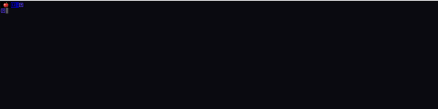

<div align="center">


# Muse

### An AI that stays with you between conversations.

<p>Muse holds the threads you didn't finish, answers from your own notes with receipts you can open,<br/>
and asks before it does anything on your behalf. You choose the model and where it runs.</p>

<p><a href="LICENSE"></a> <a href="package.json"></a> <a href="https://www.typescriptlang.org/"></a> <a href="#architecture-in-one-paragraph"></a></p>

```bash
git clone https://github.com/wlsdks/muse-agent.git && cd muse-agent
corepack enable && pnpm install:muse && muse onboard
```

</div>

<p align="center"></p>

<p align="center"><i>A real session: you park a thread, and a week later Muse hands it back — with its sources.</i></p>

---

### Contents

| | |
| --- | --- |
| **Get going** | [Install](#install) · [Local or cloud](#local-or-cloud--your-choice) · [Everyday commands](#everyday-commands) |
| **The idea** | [Continuity, the one thing Muse is for](#continuity--the-one-thing-muse-is-for) · [How Muse answers](#how-muse-answers) · [Where this is going](#where-this-is-going) |
| **The truth** | [Status: what's real today](#status--whats-real-today) · [Evidence and numbers](#evidence-and-numbers) · [What Muse will never do](#what-muse-will-never-do) |
| **The code** | [Architecture](#architecture-in-one-paragraph) · [Build and verify](#build-and-verify) · [Documentation](#documentation) |

---

## Install

### Requirements

| | |
| --- | --- |
| **Node.js** | ≥ 22.12 (24 LTS recommended) |
| **pnpm** | 10 (`corepack enable`) |
| **A model** | [Ollama](https://ollama.com) on your machine, or credentials for a supported provider |
| **OS** | macOS, Linux, Windows (CLI, API, recall, Ollama, opt-in PowerShell actuators) |

### Install from source

```bash
git clone https://github.com/wlsdks/muse-agent.git
cd muse-agent && corepack enable
pnpm install:muse     # frozen install → build → link the `muse` CLI → verify
muse onboard
```

`pnpm install:muse` requires a clean `main`. Preview it with `pnpm install:muse -- --dry-run`,
update later with `muse update`, or watch the narrated tour with `pnpm demo`. If anything looks
wrong afterwards, `muse doctor` diagnoses and repairs the local setup in one pass.

### Local or cloud — your choice

Supported choices include OpenAI, Anthropic, Gemini, OpenRouter, Ollama, and OpenAI-compatible
endpoints. If you want a local model with no model-provider API key, point Muse at one on your own
machine:

```bash
brew install ollama && ollama serve &
ollama pull gemma4:12b
muse setup local
```

Local-only is a supported posture, not Muse's identity. Turn it on explicitly with
`MUSE_LOCAL_ONLY=true` and remote model and cloud voice paths become hard errors instead of silent
fallbacks. This is a scoped egress policy, not a claim that Muse audits every network path on the
computer.

---

## Continuity — the one thing Muse is for

Most assistants start from zero every time. Muse is built around the opposite: you tell it which
thread matters, and it gives that thread back to you later — where you stopped, what changed since,
the next step, and every source it used.


### 1. Start a thread and link what belongs to it

```bash
muse thread start "Plan a birthday" --kind life
muse thread link <thread-id> note birthday.md --role context
muse thread link <thread-id> task <task-id>   --role next-step
```

### 2. Get it back when you return

```bash
muse continue <thread-id>
```

You get a **pack** — the shipped form of what the roadmap below calls the Continuity Capsule: the
stopping point, the changes since, a proposed next step, and the receipts behind each claim. Nothing is guessed — the pack is built only from sources you linked.

### 3. Tell it whether that helped

```bash
muse thread outcome <delivery-id> used     # or: adjusted, ignored, rejected
```

This is the loop that makes the next pack better. Outcomes are recorded, not inferred.

> **Muse doesn't remember apps. It remembers the state you meant to continue.**

---

## Everyday commands

| Command | What you get |
| --- | --- |
| `muse ask "when is the dentist?"` | An answer built from your own notes, each one cited and openable — and an honest *"I'm not sure"* when the evidence is weak. |
| `muse chat` | A conversation that carries over from the last one instead of starting from zero. |
| `muse today` · `muse digest` | Your day, and one evening summary instead of a stream of pings. |
| `muse remember` · `muse recall` · `muse forget` | Facts, preferences, goals and vetoes you can read, correct, and delete. |
| `muse notes` · `muse tasks` · `muse remind` · `muse calendar` | Plain files you own, with five calendar backends behind one interface. |
| `muse proactive watch` | Muse speaks first — inside a hard interruption budget, never as an autonomous send. |
| `muse mcp serve` | Other agents get read-only access to your grounded recall over MCP. |
| `muse doctor` | One-shot diagnosis and repair of a broken local setup. |

<p align="center"></p>

The same runtime drives a local web console — chat, notes, memory, continuity and the integration
status, on `muse serve`:

<p align="center"></p>

---

## How Muse answers

A personal assistant that invents a detail about your own life is worse than useless. So on the
grounded paths, retrieval is not a suggestion to the model — it is a gate in front of it.

| Step | What the code does |
| --- | --- |
| **Retrieve** | Ranks your local notes and memory for the question, across languages (a Korean question can reach an English note). |
| **Weigh** | Weak matches are lowered rather than promoted. Stale sources are marked, not silently trusted. |
| **Answer** | The reply must cite the sources it used. Citations that don't resolve are dropped from the answer. |
| **Abstain** | Below the confidence gate, Muse says it isn't sure instead of producing a confident guess. |
| **Correct** | You can contradict it. The correction is stored and decays the belief it replaced. |

**The honest limit:** this covers the supported grounded paths. Fast uncited chat is a documented
gap, not a solved problem — see [the grounding gate](docs/trust/grounding-gate.md).

---

## Where this is going

> You stopped while comparing three places to stay. Since then the flight moved, one cancellation
> deadline came close, and an 18-minute gap opened in your day. Muse prepares only the changes,
> says why now, cites every source, shows exactly how far an action would go — and asks whether to
> hold one option. If you answer *"this evening instead"*, that becomes a visible rule for this
> trip, not a hidden global preference.

Three pieces have to work for that moment to exist:

| | Piece | What it decides |
| --- | --- | --- |
| 🌘 | **Shadow Muse** | When to speak and when to stay quiet — learned before it ever interrupts. |
| 💊 | **Continuity Capsule** | The restored stopping point: changes, evidence, next step, expected time. |
| 🪪 | **Policy Card** | What Muse proposes to learn about working with you — with trial, edit, reject, rollback. |

None of the three is finished. The next section says exactly how far each one got.

---

## Status — what's real today

### Working

| Area | Notes |
| --- | --- |
| Memory, grounded recall with citations, local personal stores | Encryption at rest for memory, episodes and the action log |
| Guarded tools and browser actions, traces, checkpoints | Fail-close guards, bounded loops, timeouts |
| Explicit continuity threads | `start → link → muse continue → outcome`, end to end |
| One runtime across CLI, web/API, messaging, scheduled jobs | Same guards, same approvals, same traces |

### Partly built

| Area | Where it actually stands |
| --- | --- |
| Attunement Graph engine | Exact projection, *"what changed since I stopped"*, content-addressed observation receipts, resume compiler and a durable projection journal — all verified, all still process-local substrate |
| Continuity Capsule | Render data returned from an explicit API call. No product UI, no automatic timing |
| Shadow Muse | The ledger records the decision. It does not surface anything on its own yet |

### Roadmap

Policy Card · automatic thread detection · a durable current-world graph · standalone release of the
graph engine · organic-use evidence.

<details>
<summary><b>The fine print on the graph engine (MAG)</b></summary>

<br/>

The [Muse Attunement Graph](docs/design/attunement/attunement-graph.md) is an agent-native temporal/provenance
graph and personal context compiler — not a third-party graph DB. RAG can find *likely* context; MAG
has to prove the exact thread, time, change, source and policy relation. It runs on an embedded
SQLite store behind an isolated worker, with no external graph server required
([blueprint](docs/design/attunement/agent-native-graph-core.md)).

It is deliberately built as an independently extractable module — Muse is its first consumer and
dogfood environment. The public interface, adapter boundaries and repository-split plan are fixed in
[ADR 0001](docs/architecture/adr/0001-mag-product-module-boundary.md); TypeScript-first with Rust only for
benchmark-proven hot kernels in [ADR 0002](docs/architecture/adr/0002-mag-language-runtime-boundary.md).

What is verified today, and what those words do **not** mean:

- The neutral lifecycle `openMag({ scope, store }) → project → execute → close`, plus a durable
  projection journal and typed worker boundary. Portable export/rebuild, backup, physical forget and
  the 10K/100K/1M benchmarks are still pending.
- Observation receipts are *caller-declared* integrity evidence. They prove bytes and boundaries —
  not that Muse observed you, and not your exact stopping point.
- Freshness is honest by construction: only exact endpoint equality under a bounded head
  revalidation becomes `fresh-at-assessment`. A single read stays `unassessed` and forces downstream
  abstention rather than a guess.
- Resume baselines are per-process, capped at 16 threads, and not persisted. None of this is action
  authority, automatic behaviour, or evidence that it is useful in real life.

Sequenced in the [wow + graph roadmap](internal/goals/attunement-wow-graph-roadmap.md).

</details>

---

## Evidence and numbers

Two qualified controlled results, and nothing promoted past its evidence. Failed, unchanged and
diagnostic runs stay visible in the [evidence index](docs/benchmarks/EVIDENCE.md) instead of being
quietly dropped.

### Grounding

For the same fictional appointment question, grounding should cite the linked note instead of
answering from an assumption. Two independent controlled checks measured faithfulness:

| Check | Faithfulness (gate ON vs OFF) | Delta | False-refusal cost |
| --- | --- | --- | --- |
| Self-authored corpus | **16/17** vs **0/17** | **+0.94** | 0/12 vs 0/12 (**+0.00**) |
| SQuAD-2.0 slice | **5/8** vs **0/8** | **+0.63** | 0/8 vs 0/8 (**+0.00**) |

Different denominators; deliberately not aggregated into one headline number.


Source: [closed README evidence manifest](docs/benchmarks/readme-qualified-evidence-v1.json)

### Synthetic integrity at scale

Four corpora — **1K / 10K / 100K / 1M** — produced **1,111,000/1,111,000** records generated,
serialized, parsed and schema-validated. A separate stratified runtime sample passed **768/768**
public Muse seams across **96** cells with **0 / 0 / 0** LLM, tool and network calls; owner state
stayed byte-stable.


Source: [canonical scale JSON](docs/benchmarks/eval-datasets-scale-v1.json)

### What these numbers do not mean

- They are controlled results, not proof the agent helps in real life. The agent battery is not
  fully green today, and recall correction is not yet qualified — the per-battery record, including
  the failures, is in the [evidence index](docs/benchmarks/EVIDENCE.md).
- Controlled synthetic integrity is not personal learning, and controlled evidence is not organic
  effectiveness.
- **1,111,000 records are not 1,111,000 agent runs.**

Sources: [grounding manifest](docs/benchmarks/readme-qualified-evidence-v1.json) ·
[scale JSON](docs/benchmarks/eval-datasets-scale-v1.json) ·
[evidence index](docs/benchmarks/EVIDENCE.md).

---

## What Muse will never do

| | Boundary |
| --- | --- |
| 🚫 | **Move money.** No bank or brokerage connections, no payments, no transfers. Permanently out of scope. |
| ✋ | **Send to a third party on its own.** Email, chat, forms and bookings are draft-first: you confirm the exact content and recipient, or nothing leaves. |
| 🧵 | **Guess your threads.** Continuity threads and their source links are yours to author. Automatic detection is later, opt-in work. |
| 👤 | **Pretend to be a workspace.** One user and one private control plane — no multi-tenancy, no RBAC. |
| 📊 | **Promote evidence.** Tests, synthetic replays, diagnostics, agent trials and real outcomes stay separate ledgers. |

Enforced as deterministic code, never as a prompt instruction:
[outbound safety](.claude/rules/outbound-safety.md) · [Attunement design](docs/design/attunement/README.md).

---

## Architecture in one paragraph

`agent-core` never talks to a vendor SDK — everything goes through one `ModelProvider` interface, so
swapping models does not touch agent logic. Adapters ship for OpenAI, Anthropic, Gemini, OpenRouter,
Ollama and supported OpenAI-compatible endpoints (LM Studio is that adapter with a local
`baseUrl`, not a dedicated one); missing capabilities degrade explicitly rather than silently. Your data stays in plain files under `~/.muse/`, with memory, episodes and the action
log encrypted at rest and credentials in the OS keychain. CLI, web/API chat, messaging channels,
scheduled jobs and delegated workers all share one composition root, so guards, approvals and traces
are identical on every surface; risky local execution goes through the Rust `runner` as a child
process. MCP works both directions — external servers behind an allowlist, and `muse mcp serve`
exposing read-only grounded recall to other agents.

**Full detail:** [architecture and repository layout](docs/architecture/README.md) — the provider contract,
where every file lives on disk, the one-runtime rule, and a map of the 39 workspace packages.

---

## Build and verify

```bash
pnpm typecheck:fast   # while editing
pnpm test:changed     # only the tests related to your change
pnpm check            # full build + test, before merge
pnpm lint             # 0 errors required
```

Agent-level gates, which a type checker cannot replace:

```bash
pnpm smoke:broad      # HTTP sweep against the diagnostic provider, no API key
pnpm smoke:live       # real round-trip against local Ollama
pnpm eval:tools       # does the local model pick the right tool in one shot?
pnpm eval:agent       # judge meta-eval, must-refuse battery, plan quality
```

`smoke:live` deliberately uses local Ollama and skips when it is unreachable — a skip is not a pass.
`eval:agent` is the nightly/manual battery and is not fully green today; its current per-battery
record lives in the [evidence index](docs/benchmarks/EVIDENCE.md). `pnpm qualify:personal-agent` is a
read-only, fail-closed check of current capability, resident runtime and delivery safety. Test counts
are not proof of agent effect.

---

## Documentation

| | |
| --- | --- |
| **Start here** | [System map](docs/product/SYSTEM-MAP.md) · [Local model setup](docs/setup/setup-local-llm.md) · [Environment variables](docs/setup/ENV.md) |
| **The product** | [Attunement contract](docs/strategy/attunement.md) · [Architecture and gaps](docs/design/attunement/README.md) · [Implementation plan](internal/goals/attunement-implementation-plan.md) |
| **The graph** | [Attunement Graph](docs/design/attunement/attunement-graph.md) · [Agent-native core blueprint](docs/design/attunement/agent-native-graph-core.md) · [Roadmap](internal/goals/attunement-wow-graph-roadmap.md) |
| **Trust** | [Grounding gate](docs/trust/grounding-gate.md) · [Privacy and data](docs/trust/privacy-and-data.md) · [Evidence index](docs/benchmarks/EVIDENCE.md) · [Security](SECURITY.md) |
| **Audits** | [Full feature audit](docs/feature-catalog/INDEX.md) — a dated 2026-06-14 snapshot, written in Korean · [Personal-agent qualification](docs/development/personal-agent-qualification.md) |

## Contributing

Questions, bugs and ideas go to [GitHub Issues](https://github.com/wlsdks/muse-agent/issues);
vulnerabilities go through [SECURITY.md](SECURITY.md), not a public issue. Before changing the
repository, read [CONTRIBUTING.md](CONTRIBUTING.md), [CLAUDE.md](CLAUDE.md) and the
[domain rules](.claude/rules/). Conventional Commits, English commit messages.

[MIT](LICENSE) — runtime, adapters and tooling.
